# Azure Kubernetes Service (AKS) - Hands-on Lab Script

Mark Harrison : 27 Nov 2017, last update 24 Sep 2018


- [Part 1 - Azure Kubernetes Service (AKS)](aks-1.md) ... this document 
- [Part 2 - Helm Package Management](aks-2.md)
- [Part 3 - Monitoring Kubernetes](aks-3.md)

## Overview

Azure Container Service (ACS) allows you to quickly deploy a production ready Kubernetes, DC/OS, or Docker Swarm cluster.

AKS provides a fully managed Kubernetes based ACS cluster - it reduces the complexity and operational overhead of managing a Kubernetes cluster by offloading much of that responsibility to the Azure platform.

## Create AKS instance

All Azure resources must reside with an Azure resource group.

- Invoke the following:
  - Amend the resource group name to that required - and in the subsequent instructions
  - Amend the location to that require (check AKS is available in the region)
  - Check what versions of Kubernetes are available at the required location

```text
az login
az group create --name AKS-rg --location westeurope
az configure --defaults group=AKS-rg
az aks get-versions -l eastus -o table
```

We can now create an AKS instance using the `az aks create` command.

- Invoke the following:
  - Amend the AKS name to that required - and in the subsequent instructions
  - Amend the Kubernetes version to that required 

```text
 az aks create --name markaks --generate-ssh-keys --kubernetes-version 1.9.6
```

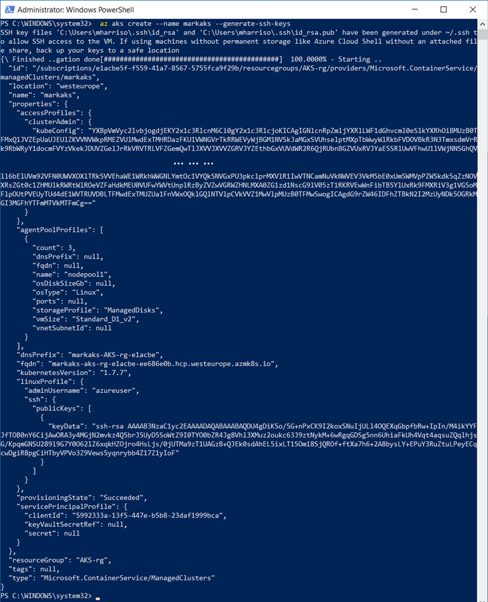

## Connect to cluster

The Kubernetes command-line tool, kubectl, is used to deploy and manage applications on Kubernetes.

- If kubectl is not installed, then invoke the following:

```text
az aks install-cli
```

To configure kubectl to connect to out Kubernetes cluster, invoke the following:

```text
az aks get-credentials --name markaks

kubectl config view
kubectl config current-context
```

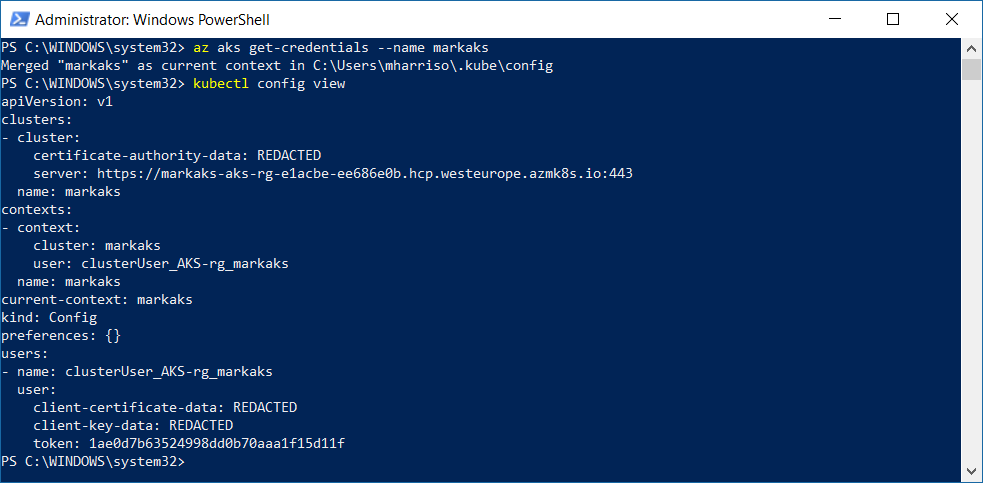

- To display the Kubernetes dashboard, invoke the following

```text
kubectl create clusterrolebinding kubernetes-dashboard --clusterrole=cluster-admin `
                                    --serviceaccount=kube-system:kubernetes-dashboard

az aks browse --name markaks
```

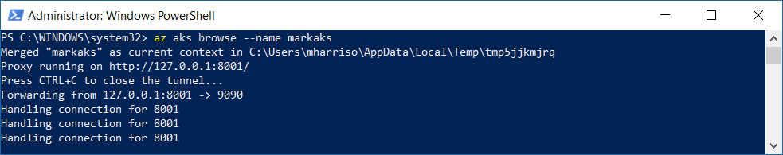

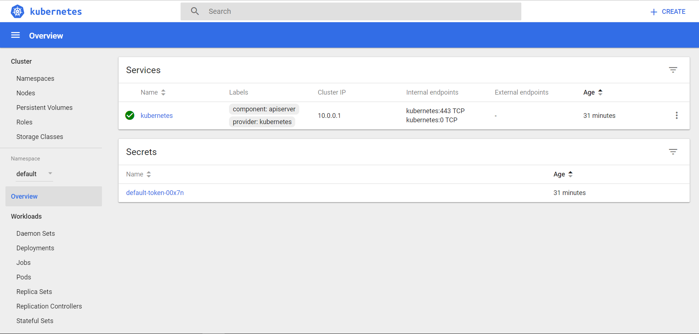

Other commands to show connection to the cluster:

```text
kubectl cluster-info
kubectl get nodes
kubectl get deployments --all-namespaces
kubectl get pods --all-namespaces
kubectl get svc --all-namespaces
az aks list -o table
```

## Deployments

The next task is to deploy our container and enable a service.  This will be a Web API application pulled from a container registry.

- Invoke the following:

```text
kubectl get deployments

kubectl run colorapi --image=markharrison/colorapi:v1 --port=80
```

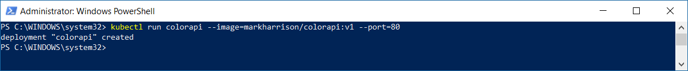

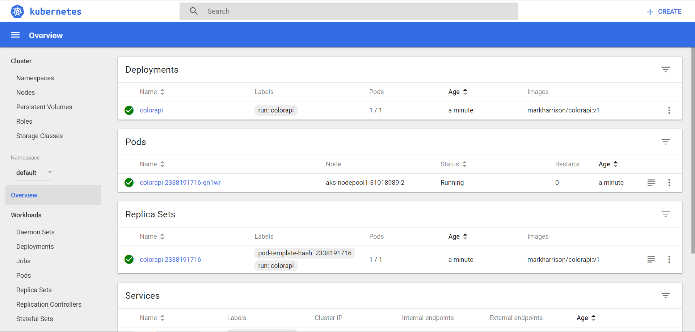

Expose the service, invoke the following:

```text
kubectl expose deployment colorapi --type="LoadBalancer" --port=80

kubectl get services --watch
```

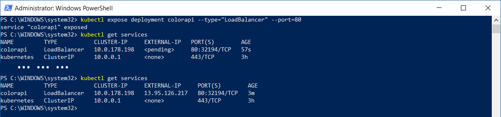

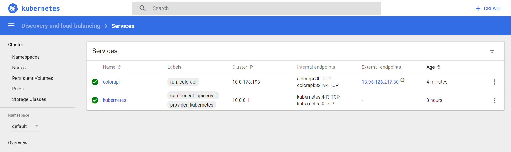

- Browse to the assigned URL (append `/swagger`) e.g. <http://13.95.126.217:80/swagger>

- This is V1 of the container - note that the RandomColor API returns a random shade of green.

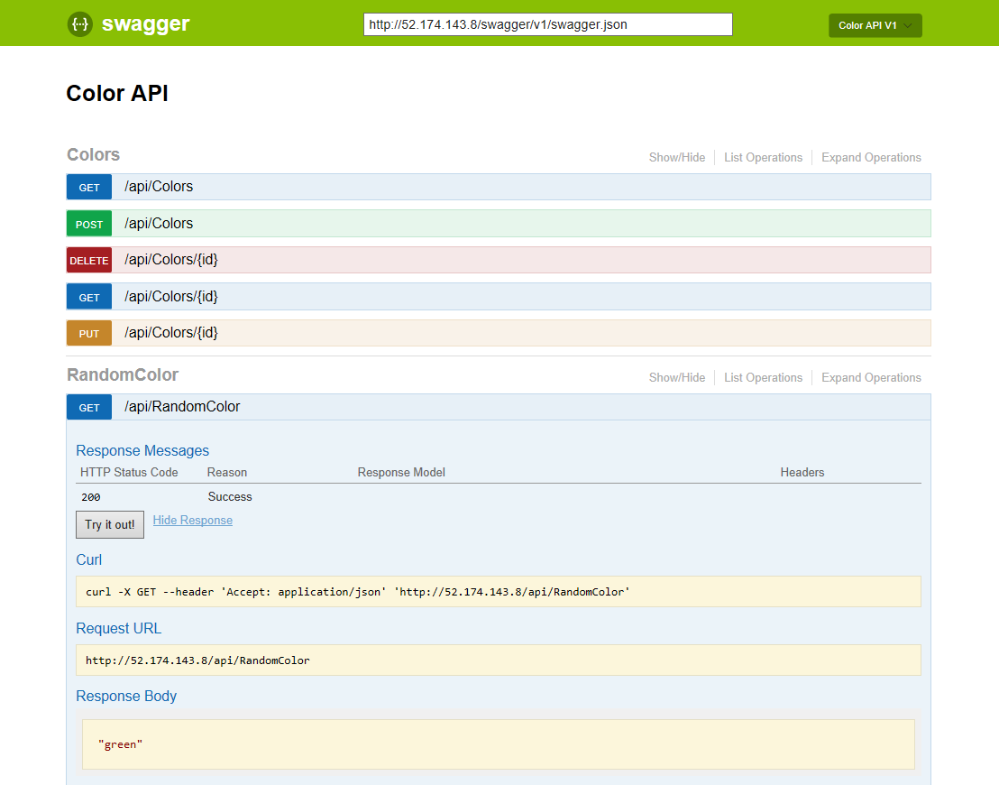

Alternatively, can we can deploy the service from within the kubernetes dashboard:

- Select [Create] top right
- Specify App name - and docker image (ColorApi) to pull
- Check logs

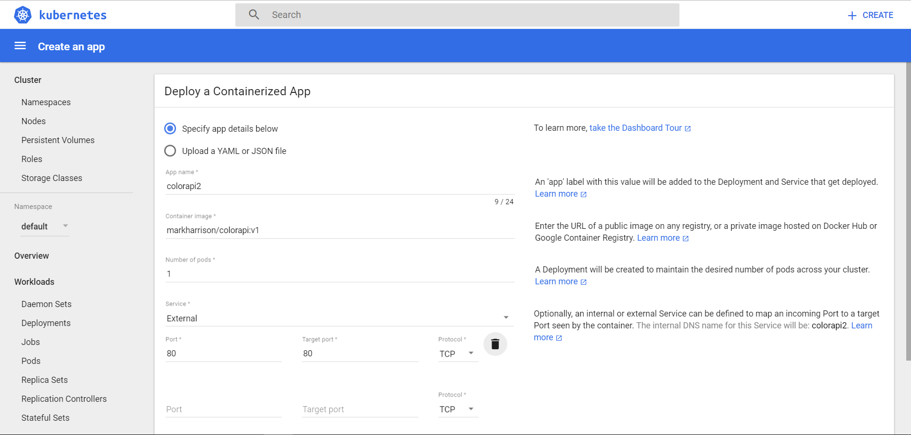

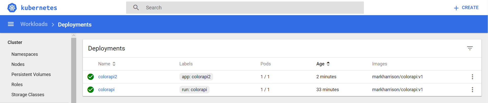

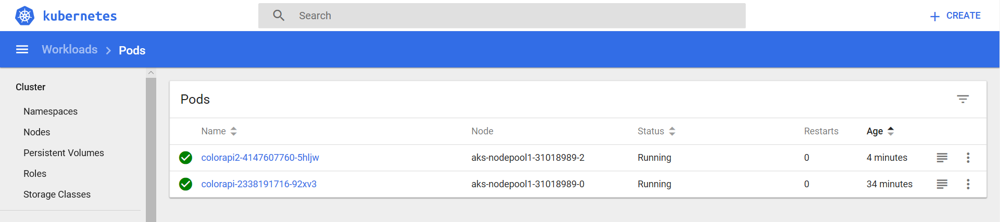

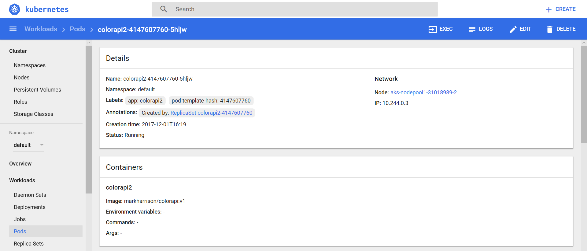

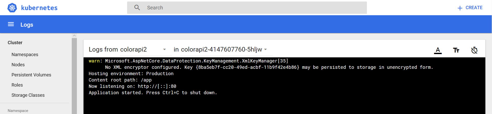

## Scale

To scale up the service, we can increase the number of pods.

- Invoke the following:

```text
kubectl get pods

kubectl scale deployment colorapi --replicas=3

kubectl get pods
```

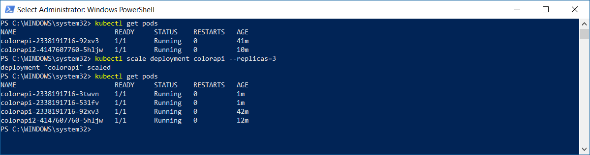

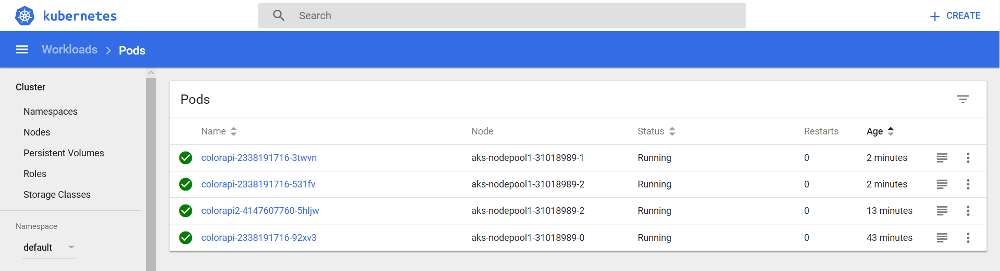

## Resilience

Lets see what happens when a Pod dissapears.

- Invoke the following

```text
kubectl get pods

kubectl delete pod <pod-id>

kubectl get pods
```

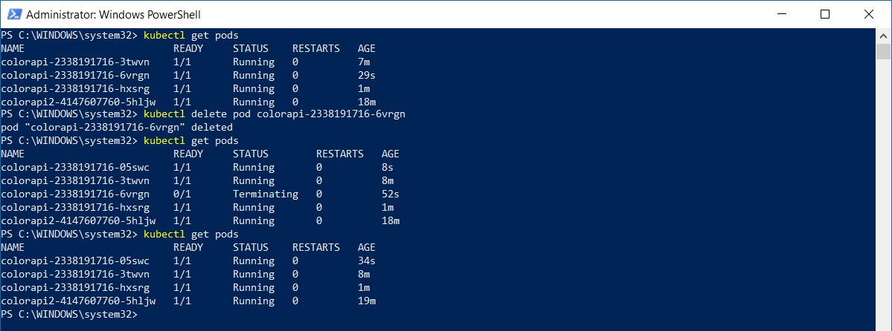

- Notice that a new Pod is started, so that the number of pods remains at the required level

## Update

To update the service to a new version of the sofware, we can update the deployment definition.

- Invoke the following:

```text
kubectl edit deployment colorapi
```

- Edit the container image to point to V2 - save the file

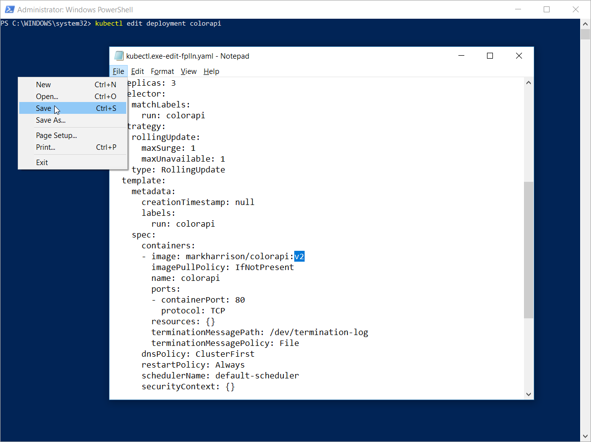

- Browse to the service - same URL as before
- Note that V2 of the RandomColor API returns a random shade of blue (from above, it was previously shades of green).

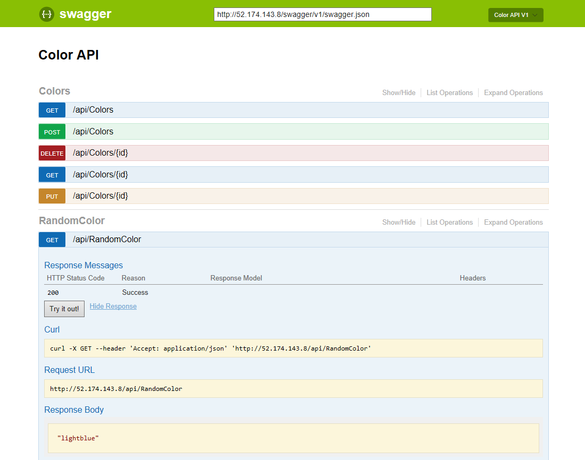

## Stop / Delete

To tidy up, delete the resource group

- Invoke the following :

```text
az group delete --name aks-rg -y
```

---
[Home](aks-0.md) | [Next](aks-2.md)
