# Azure Kubernetes Service (AKS) - Hands-on Lab Script

Mark Harrison : 7 Apr 2018, last update 24 Sep 2018


- [Part 1 - Azure Kubernetes Service (AKS)](aks-1.md)
- [Part 2 - Helm Package Management](aks-2.md)  ... this document
- [Part 3 - Monitoring Kubernetes](aks-3.md)

## Helm

[Kubernetes Helm](https://github.com/kubernetes/helm) is a tool for installing packages of pre-configured Kubernetes resources.

Discover & launch  Kubernetes-ready apps at <https://hub.kubeapps.com/>

### Install

- To install Helm on Windows, use the Chocolately package at <https://chocolatey.org/packages/kubernetes-helm>

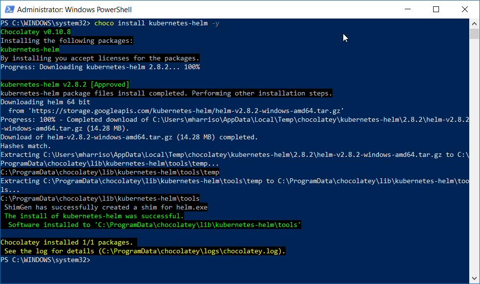

Helm has two parts: a client (Helm) and a server (Tiller). Tiller runs inside of your Kubernetes cluster, and manages releases (installations) of your charts (packages).

- To install the Tiller, use the commands:

```text
kubectl create serviceaccount -n kube-system tiller
kubectl create clusterrolebinding tiller --clusterrole=cluster-admin --serviceaccount=kube-system:tiller

helm init --service-account tiller
```

We can see that the Tiller has been installed as a Pod

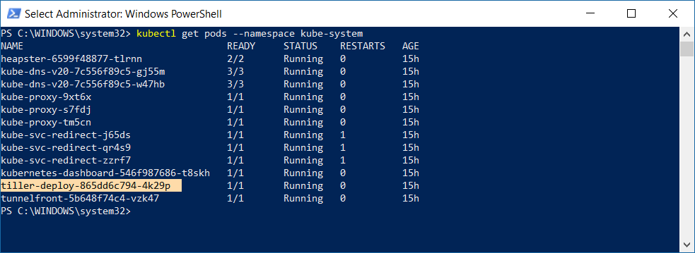

## Helm Example - WordPress

WordPress is one of the most versatile open source content management systems on the market. A publishing platform for building blogs and websites.  There is a Helm chart for installing Wordpress and the associated MariaDB database. <https://hub.kubeapps.com/charts/stable/wordpress>

### Install

- To install WordPress use the command:

```PowerShell
helm install --name wordpress `
    --set wordpressUsername=admin,wordpressPassword=password,mariadb.mariadbRootPassword=secretpassword `
    stable/wordpress
```

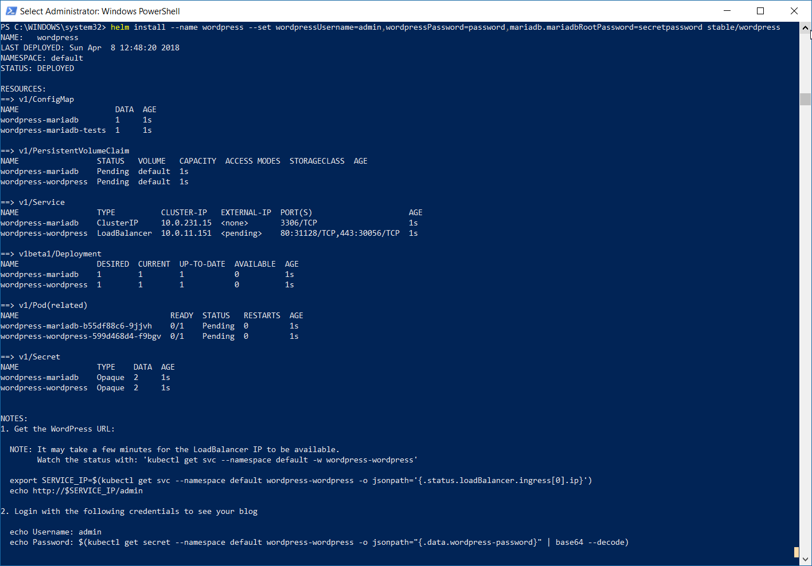

A short period is required for the external load balancer to be created and the WordPress application to be exposed as a service.  We can get the IP address from the command:

```PowerShell
kubectl get svc --namespace default -w wordpress-wordpress
```

### Access WordPress

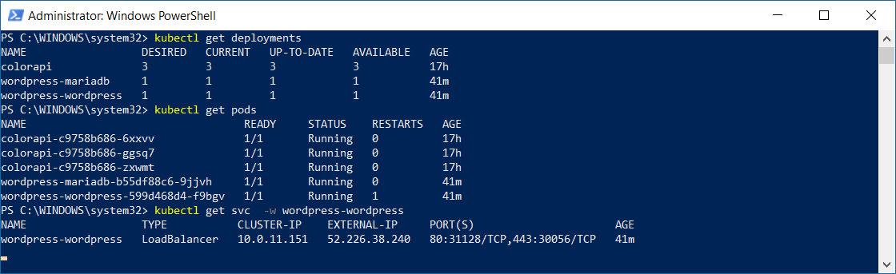

The WordPress administration is at <http://external-ipaddress/admin>

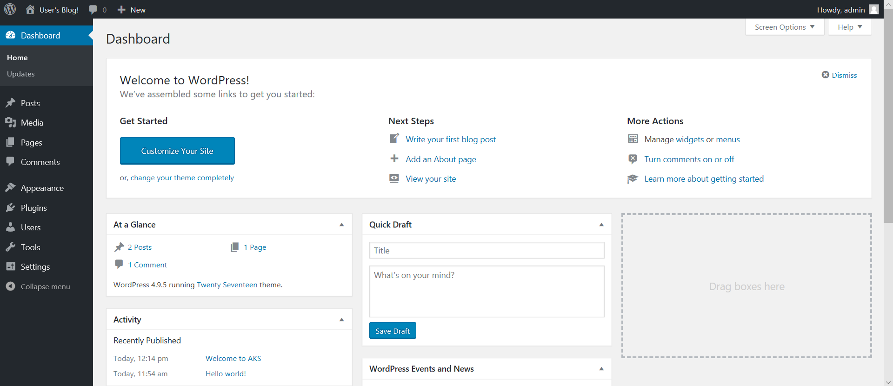

The WordPress blog is at <http://external-ipaddress/>

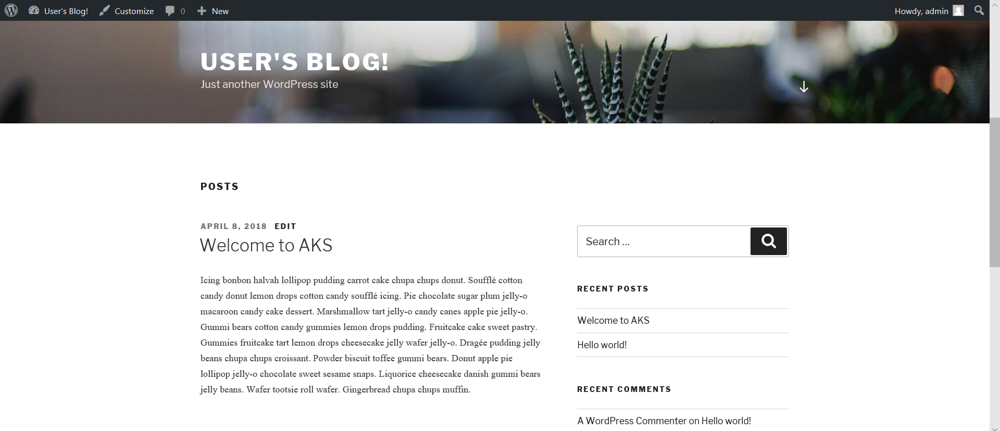

### Tidy Up

- To remove the WordPress deployment, use the following command

```PowerShell
Helm delete --purge wordpress
```


## Create Helm chart

Lets now create a Helm chart for our ColorAPI service.

### Scaffold project

We can use the `Helm Create` command to scaffold a starter example, which we can then amend.  Full documentaion is at <https://github.com/kubernetes/helm/blob/master/docs/charts.md>

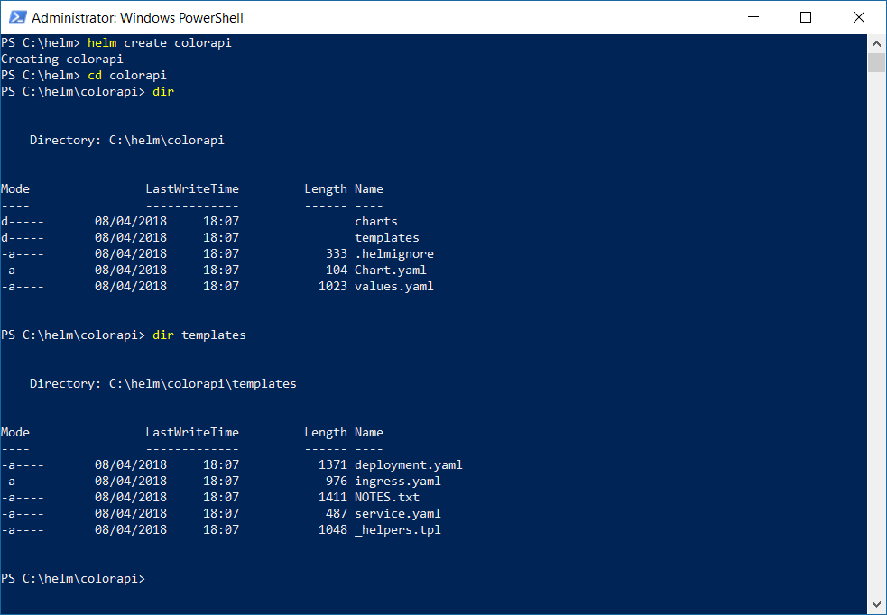

 The `templates/ directory` is where Helm finds the definitions for the Services, Deployments and other Kubernetes objects.  Helm runs each file in this directory through the [Go template](https://golang.org/pkg/text/template/) rendering engine and interjects values from the `values.yaml` file or specified in the Helm command line.

 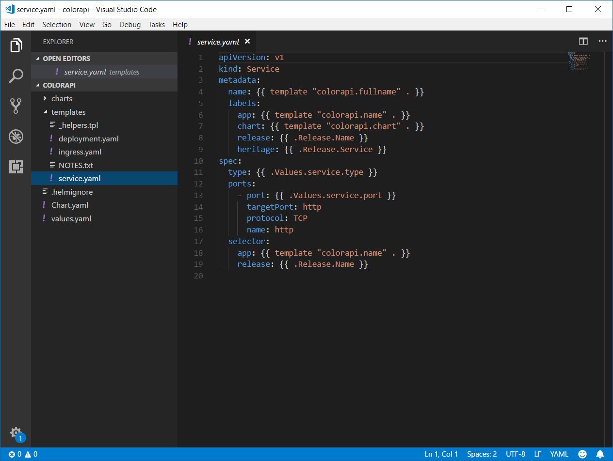

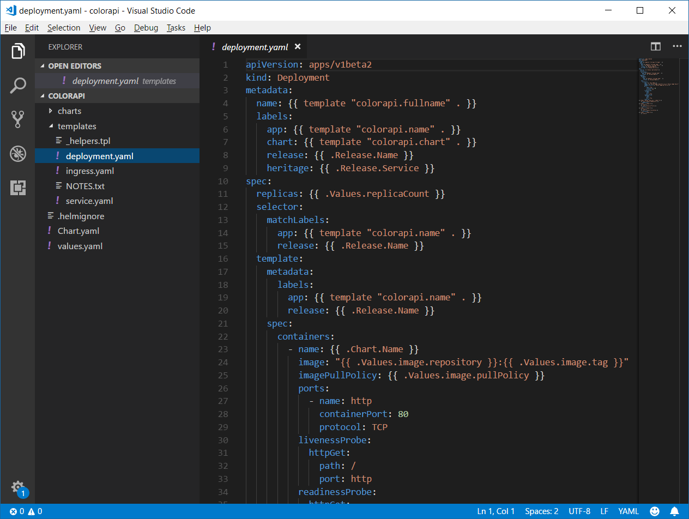

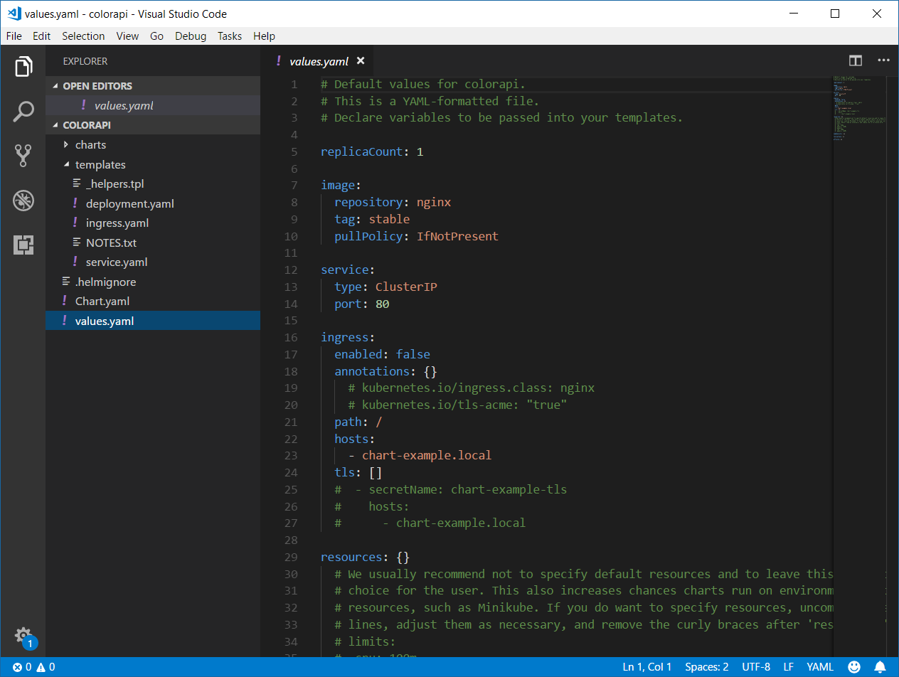

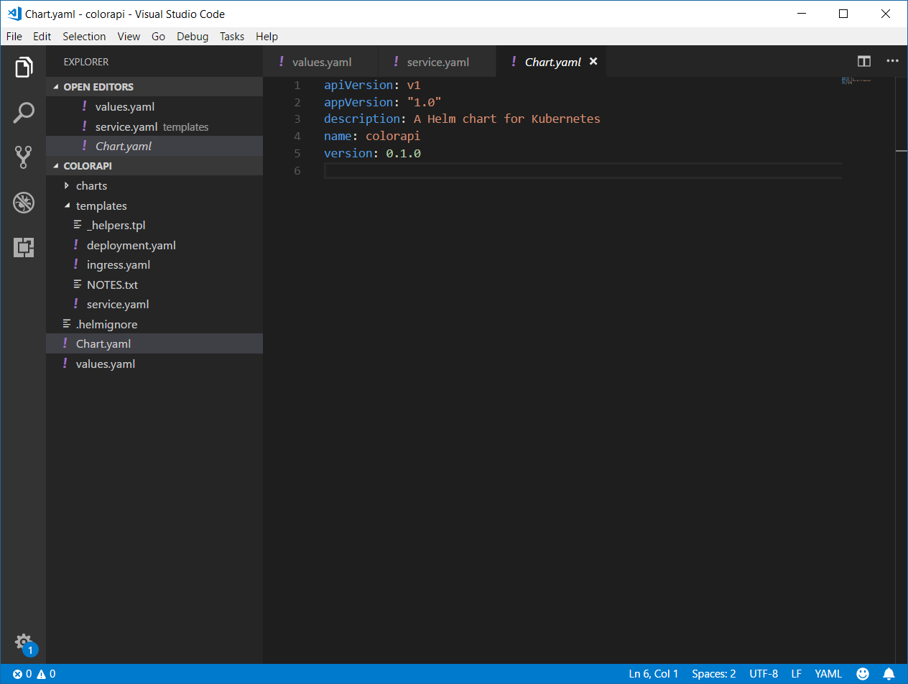

### Configure chart

Lets make some changes for our ColorAPI service:

- Delete the unused ingress.yaml and NOTES.txt
- In `values.yaml`

```yaml
image:
  repository: markharrison/colorapi
  tag: v1
  pullPolicy: IfNotPresent

service:
  type: LoadBalancer
  port: 80
```

- In `deployment.yaml` ammend the probe paths to the '/swagger/' URL (there is no web app at the root)

```yaml
          livenessProbe:
            httpGet:
              path: /swagger/
              port: http
          readinessProbe:
            httpGet:
              path: /swagger/
              port: http
```

- Test the Helm install with a dry-run and examine the generated yaml output

```PowerShell
helm install --dry-run --debug ./colorapi
```

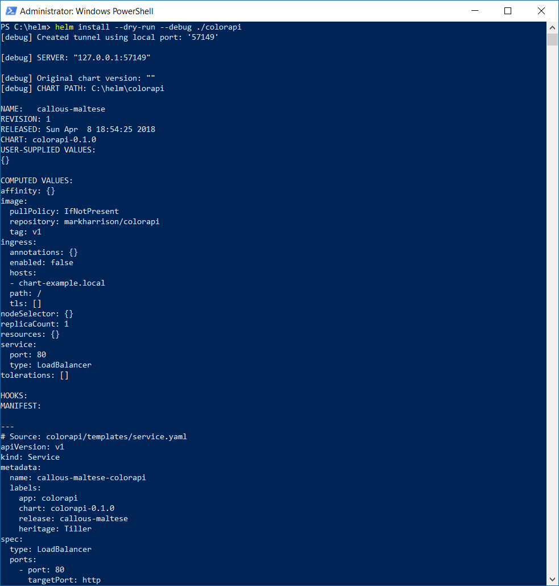

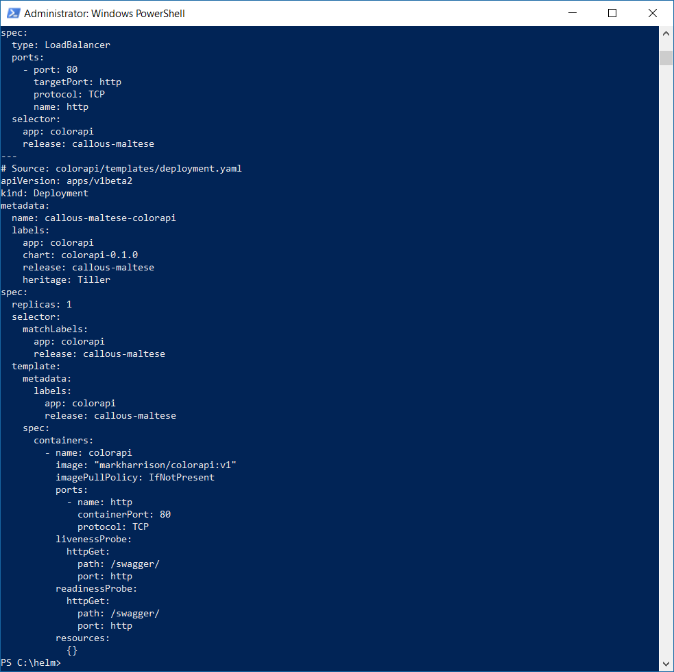

### Install Chart

- If all is OK with what is being generated, we can do a real install:

```PowerShell
helm install --name rainbow  ./colorapi
```

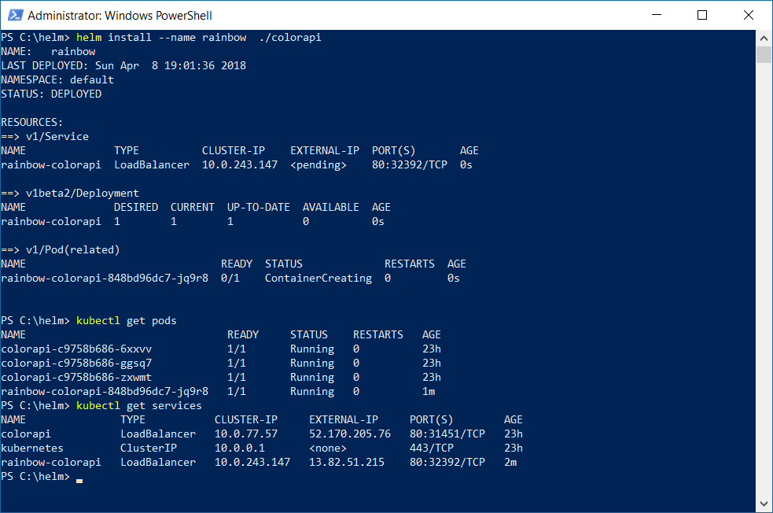

- Get the IP address of the exposed service using `kubectl get services`
- Navigate to the swagger page

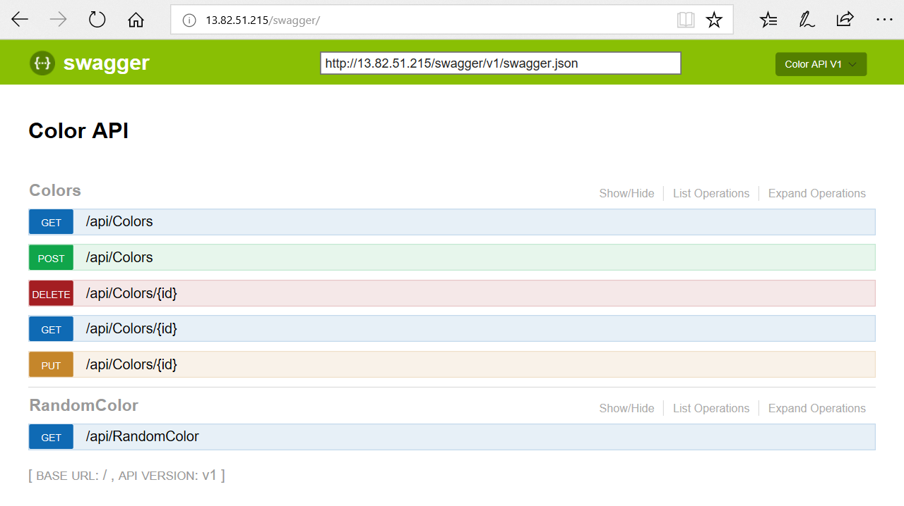

### Share Chart

To share your charts we have to create a tar package, that could be stored in a central repository.

- Use the ```Helm Package` command

```PowerShell
helm package ./colorapi
```

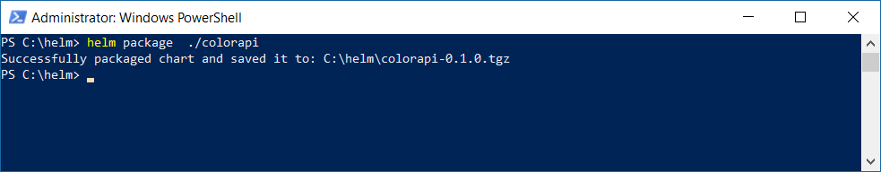

- Validate the package - install the chart by specifying the tar file.

```PowerShell
helm install --name rainbow2 colorapi-0.1.0.tgz
```

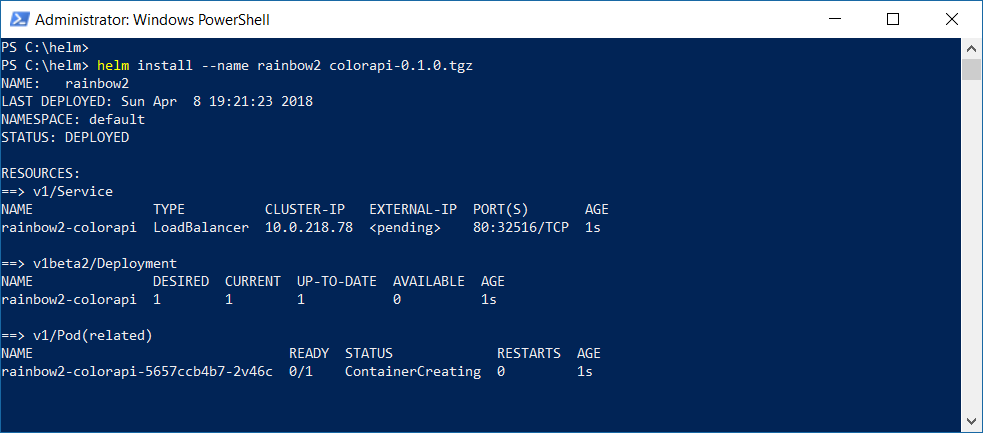

### Tidy Up

To remove the Helm charts:

```PowerShell
helm delete --purge rainbow
helm delete --purge rainbow2
```

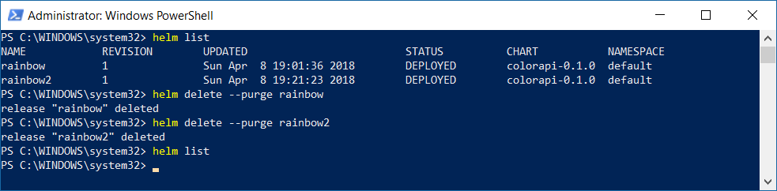

To remove Helm from the cluster:

```PowerShell
helm reset
```

---
[Home](aks-0.md) | [Prev](aks-1.md) | [Next](aks-3.md)
